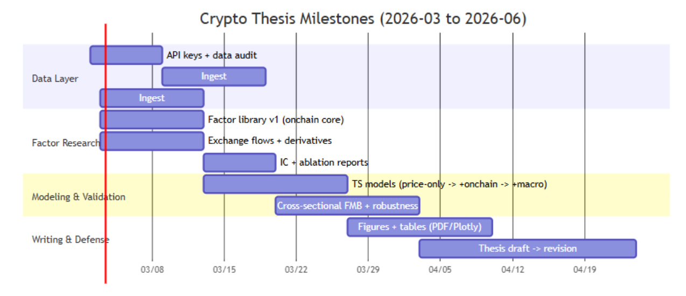

# 加密貨幣鏈上因子收益預測研究專案計畫

## Executive Summary

本計畫建議把你的畢業論文/研究專案拆成「同一套工程、兩條可交付的研究主線」：其一是 **時間序列（TS）收益預測＋真實摩擦回測**（對 BTC/ETH/SOL 先做深、再可擴）；其二是 **橫截面（CS）因子定價檢驗（Fama–MacBeth）**，用以回答「鏈上資料是否提供**可被定價/具有增量資訊**的風險因子」這個更像論文的核心問題。這樣你既保留你已經很成熟的工程流水線，又能把論文論點升級成「鏈上因子”的實證研究」而非只是一個交易績效展示。

資料層面採「先免費可落地、再逐步升級」：優先用 Coin Metrics Community（鏈上＋部分市場資料）、Glassnode（含交易所流入流出、且有 Point‑in‑Time 版本適合回測）、Blockchain.com（BTC 指標）、Etherscan（ETH 細項）、FRED（宏觀；可用 ALFRED/Real‑time 參數避免修正值造成前視偏誤）、Deribit（衍生品）。如有預算或可取得學術方案，再接入 Kaiko（更高品質的成交/委託簿）與 Coinbase/Kraken 等交易所官方 API 做市場微結構補強。

方法層面採「可審稿、可復現」：一律使用 walk‑forward/rolling window；嚴格 label shift；所有特徵建立「時間可得性（availability）」欄位與 leakage assert；宏觀資料用 FRED realtime_start/realtime_end（或 vintage_dates）對齊「當時可得」；鏈上資料優先使用 Glassnode PiT（append‑only）版本；比較模型時用 Diebold‑Mariano（DM）檢定評估預測力增量。

最後的交付物（論文可直接引用）建議固定為：  
(1) 資料來源與清洗對齊章節（含 coverage matrix）；(2) 鏈上因子庫與經濟直覺（含公式與前處理）；(3) TS 預測結果（RankIC/OOS R²/DM）；(4) CS 定價結果（λ、t‑stat、CS R²、rolling R²）；(5) 策略回測（含成本、max drawdown、穩健性分段）與圖表報告模板。

## 研究定位與研究問題

你的題目「基於鏈上資料的加密貨幣收益預測」建議用兩個層次回答同一個核心問題：**鏈上行為是否能解釋/預測收益**。在金融實證上，常見做法是同時提供「預測（forecasting）」與「定價（pricing）」證據：預測證明可用於形成預期；定價證明其在資產定價模型中具有系統性風險溢酬或橫截面解釋力。

建議明確寫出三個可檢驗假說（論文語言）：

- 假說 A（增量預測力）：加入鏈上因子後，模型在 out‑of‑sample 的 RankIC 與 OOS R² **顯著提升**，且提升可被 DM 檢定支持（相對 price‑only baseline）。
- 假說 B（鏈上定價/風險因子）：以鏈上「網路採用/使用（network）」與「算力/安全（computing power）」構造的因子，對加密資產的期望報酬具有解釋力，且可與傳統 return‑based 因子（market/size/momentum）相比。
- 假說 C（宏觀條件化）：宏觀流動性/政策衝擊會改變鏈上因子對收益的邊際效果（例如在緊縮/震盪期更顯著或更弱），並需用「資料發布延遲」對齊避免前視偏誤。

在寫作敘事上，請把「牛熊」定位為 **結果分段/穩健性檢驗維度**（regime analysis），不要把它當成你先驗“判斷”後再做模型的前提；這樣比較符合研究設計且不會被質疑為事後挑選。中文文獻中也常用分段/事件穩健性來檢驗加密市場策略表現，你可在文獻回顧引用相關中文研究作為對照。

## 資料來源與取得策略

下表是建議的「資料來源優先級」：先確保免費/可取得的主幹能跑通，再逐步升級可靠性與粒度。所有 URL 以程式碼形式列出（符合你要求的「可操作」）。  
（註：你現有專案根目錄假設為 `E:\Python_workplace\crypto_predict`。）

### 資料來源比較表

|類別|來源（優先序）|URL（官方/主要文件）|取得方式與格式|認證/限速重點|推薦頻率與用途|
|---|---|---|---|---|---|
|價格（baseline）|Yahoo Finance + `yfinance`（快、好用但非官方）|`https://github.com/ranaroussi/yfinance`|Python 套件，常用 OHLCV（日/分鐘視 ticker）|非官方、可能被限流/變更；僅建議研究用途。|日頻：論文 TS baseline（BTC/ETH/SOL 起步）|
|價格（高品質）|Coin Metrics Market/Reference（可升級）|`https://docs.coinmetrics.io/api/v4`|REST/CSV/JSON|Community：10 req / 6s / IP；Pro：6000 req / 20s / key。|日或更高：用於提高價格資料品質、減少交易所雜訊|
|價格/微結構（tick）|Kaiko（通常付費；品質高）|`https://docs.kaiko.com/`|REST/Stream；含 order book、trades、OHLCV/VWAP|`X-Api-Key`；429 代表觸發限速（配額依方案）。|30s~tick：微結構因子、委託簿不平衡、滑價估計|
|交易所 OHLCV/委託簿|CCXT（廣覆蓋；注意各交易所限速）|`https://github.com/ccxt/ccxt/wiki/manual`|REST 封裝（OHLCV、trades、order book）|建議開 `enableRateLimit`；各交易所 rateLimit 不同。|小時/分鐘：微結構與流動性因子|
|鏈上（核心）|Coin Metrics Network Data（建議主幹）|`https://coinmetrics.io/community/`|Community：REST（多為 24h 解析度）|Community 提供免費但有配額與可用指標限制。|日或週：網路活動/供給/估值（active addresses 等）|
|鏈上（補強）|Glassnode（含交易所流）|`https://docs.glassnode.com/basic-api/`|REST（CSV/JSON）|常見預設 600 req/min；有 `x-rate-limit-*` headers；建議用 Bulk endpoints。|日/小時：交易所流、持幣結構、估值因子|
|鏈上（回測友善）|Glassnode Point-in-Time（PiT）|`https://docs.glassnode.com/basic-api/endpoints/pit`|PiT 版本（append-only）|PiT 歷史不可變，適合量化回測避免回填修正。|日：**強烈建議**用於模型回測與論文可重現性|
|BTC 指標（免費）|Blockchain.com Charts/Stats|`https://www.blockchain.com/en/api/charts_api`|REST；支援 `format=csv/json`、`timespan`、`rollingAverage`|無 key；UTC；可選 sampled 降點數。|日/週：BTC hashrate、交易數、費用等|
|ETH 明細（地址/合約）|Etherscan|`https://docs.etherscan.io/`|REST；需要 API key|Free 3 calls/sec（另有日配額）；或依方案提升。|日～事件級：ETH gas、合約互動、特定地址流量|
|衍生品（核心）|Deribit（期權/永續/期貨）|`https://docs.deribit.com/`|REST/WebSocket|公開端點可不認證，但未認證更容易被更嚴限速；採 credit-based rate limiting；私有端點需 OAuth2 風格 token。|分鐘～日：funding、OI、IV、skew、gamma exposure|
|衍生品（可選）|Binance / Coinbase / Kraken（官方）|`https://academy.binance.com/zh-TC/articles/how-to-avoid-getting-banned-by-rate-limits`|REST/WebSocket|Binance 以 request weight 計算、會回 429；Coinbase/Kraken 有各自 rate limit 規則。|分鐘：更廣泛的 funding/OI 或多交易所對照|
|宏觀（必要）|FRED/ALFRED（St. Louis Fed）|`https://fred.stlouisfed.org/docs/api/fred/`|REST（json/csv 等；csv 為 zip）|有 API key；超過約 2 req/sec 會回 429；可用 realtime_start/end 做 vintage alignment。|日/週/月：利率、CPI、流動性、VIX proxy 等|

### 取得與資料治理的「硬規範」

為了避免你最在意的未來資料洩漏，建議把每一筆資料都賦予 **可得時間**（availability timestamp），並在 build_dataset 時做 assert：

- 鏈上：優先用 Glassnode PiT（不會事後修正），若不得不使用一般版（mutable），就要在論文中交代其「近期點可能被微調」的特性。
- 宏觀：FRED 預設是「今天看回去」的最新版資料；若你要嚴謹回測，需使用 realtime_start/realtime_end 或 vintage_dates 抓取「當時版本」。
- 價格：交易所資料要明確指定「UTC 日界線」與 OHLCV 的定義；若使用 yfinance 需在論文說明它是非官方、可能被限流/結構變更。

## 因子庫設計

本節提供你要求的「加密貨幣特定候選因子清單」，按七大類分組。每個因子都給出：定義/公式、頻率、前處理（winsorize/zscore/de‑season）、以及經濟直覺。你可以把這一節幾乎原封不動搬進論文的「變數定義與經濟意涵」章節。

先定三個共用前處理規格（建議全專案統一）：

- Winsorize：對每個資產的因子序列做 1%/99% 去極值；若你做橫截面（多幣）FMB，另加「每期 cross‑section winsorize」避免單一小幣把 λ 拉歪。
- Z‑score：用 rolling window 標準化（例如 252 交易日或 52 週），並把 window 長度寫死在 config 裡，可復現。
- De‑season：鏈上活動常見「週期性（週末效應）」；可用兩種等價做法：
    - 直接改用週頻（例如週五到週五）以減少 day‑of‑week effect；此做法在加密研究中常見，亦被用來降低日內噪聲與週期效應。
    - 或保留日頻但用 day‑of‑week dummy/rolling seasonal mean 做去季節化（適合你需要日頻回測時）。

### 候選因子清單表

|分組|因子（建議命名）|精確定義/公式（以 t 為當日）|推薦頻率|前處理|經濟直覺（可寫進論文）|主要資料源|
|---|---|---|---|---|---|---|
|網路活動|`aa_g`（Active Addr Growth）|`Δlog(ActiveAddresses_t)`；ActiveAddresses 以「該期間參與 ledger change 的唯一地址數」定義。|日或週|winsorize + zscore + de‑season|採用/使用度提升可能代表基本面需求增加（network adoption）。|Coin Metrics / Glassnode|
|網路活動|`txcnt_g`（Tx Count Growth）|`Δlog(TxCount_t)`|日或週|同上|交易活動升溫＝鏈上使用增加；若伴隨費用上升，可能反映擁塞與需求。|Blockchain.com / Coin Metrics|
|網路活動|`fees_per_tx`|`Fees_t / TxCount_t`（或取 log）|日或週|winsorize + zscore|平均手續費可視為區塊空間需求與擁塞壓力；可能與風險偏好/投機熱度同向。|Blockchain.com Stats/Charts|
|網路活動|`txvol_usd_g`|`Δlog(TxVolumeUSD_t)`（可用 on-chain transfer volume）|日或週|去極值 + 去季節|支付/結算需求或資金移動強度，可能領先價格（但要注意交易所內部轉帳與混幣）。|Glassnode / Coin Metrics|
|供給/持幣結構|`supply_g`|`Δlog(CirculatingSupply_t)`|週/月（依幣種）|winsorize + zscore|供給增速上升（PoW/PoS 發行）代表稀釋壓力；與風險溢酬可能相關。|Coin Metrics|
|供給/持幣結構|`cdd`（Coin Days Destroyed）|`Σ(coin_amount_i × days_since_last_moved_i)`（概念性定義）|日或週|winsorize + zscore|老幣移動代表長期持有人行為變化；常被解讀為“供給解鎖/獲利了結”。|Glassnode Indicators|
|供給/持幣結構|`nvts`（NVT Signal）|NVT Signal 使用交易量的長期移動平均改善原始 NVT，作為領先指標。|日|去極值 + zscore|市值相對於鏈上交易量的偏離，常用於估值/過熱程度判斷。|Glassnode|
|交易所流（鏈上）|`ex_netflow`|Exchange Netflow = inflow − outflow（淨流入/流出）。|日/小時|**優先**使用 PiT；winsorize|淨流入常被視為可售供給增加（賣壓）；淨流出可能代表冷錢包囤積。|Glassnode|
|交易所流（鏈上）|`ex_inflow` / `ex_outflow`|分別取 inflow / outflow（可做比例/成長率）|日/小時|PiT + 去極值|拆分淨值能區分“同時大量進出”的再平衡 vs 單邊資金移動。|Glassnode|
|交易所流（鏈上）|`ex_netflow_by_size`|netflow 依 transfer size 分桶（whale vs retail）|日|PiT + zscore|大額淨流入更可能代表機構/巨鯨調倉；可做風險偏好代理。|Glassnode（by_size 端點族）|
|礦工/驗證者（PoW/PoS）|`hashrate_g`|`Δlog(Hashrate_t)`（PoW）|日/週|去極值 + zscore|算力代表安全性/資本投入；文獻以其作為“production/security”代理。|Blockchain.com / Coin Metrics|
|礦工/驗證者（PoW/PoS）|`difficulty_g`|`Δlog(Difficulty_t)`（PoW）|週|去極值|難度上升通常滯後於算力與價格；可作景氣/成本壓力。|Blockchain.com Stats|
|礦工/驗證者（PoW/PoS）|`miner_rev_ratio`|`MinerRevenueUSD_t / MarketCap_t`（或對數差分）|日/週|去極值 + zscore|礦工收入與拋壓/資本回收相關；高收入期可能伴隨賣出。|Blockchain.com Stats|
|市場微結構|`amihud_illiq`|`|r_t|/ VolumeUSD_t`（日內可用更細粒度）|日|winsorize + zscore|
|市場微結構|`spread`（bid‑ask）|`(ask1 − bid1) / mid1`|分鐘～日|去極值 + zscore|spread 擴大代表交易成本與不確定性升高；可作風險代理。|Kaiko（order book）|
|市場微結構|`obi`（order book imbalance）|`(Σbid_size − Σask_size)/(Σbid_size+Σask_size)`（多層）|秒～分鐘|平滑（EMA）+ zscore|買盤/賣盤不平衡可能短期預示價格壓力；但容易被做市噪聲污染。|Kaiko / CCXT|
|衍生品|`funding`（perp funding）|永續合約 funding rate（可用平均/變化）|8h/日|去極值 + zscore|funding 正且偏高常代表多頭擁擠；後續可能均值回歸或波動上升。|Deribit / Binance|
|衍生品|`oi_g`（Open Interest Growth）|`Δlog(OpenInterest_t)`|小時/日|去極值 + zscore|OI 上升代表槓桿參與增加；與未來波動/清算風險相關。|Deribit|
|衍生品|`basis`（期貨基差）|`(F_t − S_t)/S_t`（同到期）|日|去極值 + zscore|基差反映資金成本/需求；與風險偏好或套保需求相關。|Deribit + 現貨（Kaiko/CCXT）|
|衍生品|`iv_level`（IV 水平）|隱含波動率（例如 ATM IV 或指數）|分鐘～日|平滑 + zscore|IV 上升代表不確定性上升；可作風險狀態或保險需求代理。|Deribit|
|衍生品|`iv_skew_25d`|`IV_put(25d) − IV_call(25d)`（概念）|日|平滑|偏度反映下行保護需求；可作尾部風險情緒因子。|Deribit|
|情緒/注意力|`attention_google`|Google Trends 指數（建議做 `Δ` 或 zscore）|日/週|去季節 + 平滑|注意力上升常見於投機熱度或重大事件期；可能提升波動與交易量。|Google Trends（非官方）|
|情緒/注意力|`sentiment_reddit`|Reddit 貼文/留言數變化（或情緒分數）|日/週|去極值|注意力與敘事驅動在幣市常見，可作風險偏好代理。|第三方/自建爬蟲|

### 宏觀變數（額外建議，非鏈上核心但符合任務書）

宏觀變數的關鍵不是“多”，而是**可得性對齊**：大部分宏觀序列有修正（revision），回測若用最新版會產生前視偏誤，因此要用 ALFRED/Real‑time 參數回到「當時可得」。

推薦的最小宏觀集合（可在 FRED 取得）：

- 政策利率/短端：Fed Funds、SOFR（利率水準）
- 殖利率曲線：2Y、10Y、term spread（緊縮/寬鬆）
- 通膨：CPI / PCE（或 breakeven）
- 流動性：M2 或資產負債表 proxy
- 風險：VIX 或信用利差 proxy

如你要引用宏觀衝擊對 BTC 的實證動機，可引用「貨幣政策衝擊與比特幣價格」的相關研究作為宏觀章節切入點。

## 模型與驗證設計

本節給你一套「baseline → 擴展 → 定價檢驗 → 混合模型」的模型組合，以及對應的評估指標與驗證協定；你可以直接把它寫成論文的研究設計（Methodology）章節。

### 模型組合（由易到難、且可對照增量）

時間序列（TS）預測（單幣或少幣）：

- Baseline‑0：Naive（例如 `r_{t+7}` 用 `r_{t}` 或 0 预测）＋ price factors（MA/RSI/vol 等）＋線性模型（Ridge/ElasticNet）
- Baseline‑1：price + on‑chain（上表核心鏈上因子）＋線性/樹模型（LightGBM/XGBoost/HistGBDT）
- Baseline‑2：price + on‑chain + macro（含 release lag / ALFRED）
- Extended：加入 exchange flows / derivatives / microstructure（視資料可得性）

橫截面（CS）定價（多幣，建議至少 15–30 幣）：

- FMB‑1：鏈上基本面因子（network / computing power）→ β → λ（Fama–MacBeth）
- FMB‑2：鏈上因子 + return‑based 因子（market/size/momentum）做對照（可參考加密資產特定因子文獻）。
- Robustness：對多交易所/多資料源重跑（因加密市場存在顯著跨交易所價差與分割）。

混合模型（把工程流水線升級成論文貢獻）：

- Hybrid‑Stacking：先用 FMB 得到每期風險溢酬與預期報酬，再用 ML 對「殘差」做預測；或把 λ/β 當作 TS 模型的特徵。
- Hybrid‑Regime：把宏觀狀態（如政策緊縮 proxy）作為 interaction term，而不是先驗分牛熊。

### 評估指標（你要求的全套）

預測（forecast）指標：

- RankIC / IC：`corr(pred_t, realized_{t+7})`（含 rolling 版本）
- OOS R²：相對於 benchmark 的 out‑of‑sample 擬合
- MAE / MSE：回歸誤差
- DM test：比較「price‑only vs price+onchain」的預測準確度差異是否顯著（Diebold–Mariano）。

交易（economic value）指標：

- Sharpe、年化報酬、最大回撤（max drawdown）、turnover、cost‑adjusted return
- 交易成本：用 bps 參數化；在圖表與表格中固定成本假設並做敏感度分析（例如 5/10/20 bps）

定價（asset pricing）指標：

- λ（risk price）估計與 t‑stat（FMB second stage）
- CS R²（每期與平均）、rolling CS R²（看“在哪些時期更有效”）
- 안정性：λ 的時間序列與 breakpoints（可對照市場制度改變）

### 驗證協定（walk‑forward / rolling 與 leakage checks）

時間序列 walk‑forward（建議預設，可寫入 config）：

- 目標：7 日 log return：`y_t = log(P_{t+7}/P_t)`（嚴格 shift；任何特徵必須只用到 t）
- 切分：train=3 年，val=6 個月，test=6 個月，step=3 個月（資料不足時退化成 70/30，但仍保持「時間順序」）
- Horizon 重疊避險：因為 7 日 label 會重疊，建議在 val/test 前做 embargo（例如 7 天）或在切分時用 purge 概念（至少保證訓練資料 label 不跨到測試期）。
- Leakage check（必做）：
    - `max(feature_time) <= label_time - horizon`
    - 宏觀：使用 realtime_start/end，且考慮發布延遲（release_lag_days）
    - 鏈上：優先 PiT（append‑only），否則要在論文說明 mutable 的風險

橫截面 rolling‑FMB（建議參數）：

- 週頻資料（例如週五到週五）可降低日內噪聲與 day‑of‑week effect；加密研究亦常採週頻處理。
- Rolling β window：156 週（約 3 年）
- 每週估計一次 λ；輸出：λ_t 序列、平均 λ、t‑stat、CS R²_t
- 幣種集合：建議先做「balanced panel」避免存活者偏誤與上市/下市造成樣本流失偏差（可在論文中引用“balanced panel”作為設計選擇）。

## 實作路線圖與交付物

以下路線圖假設你現有工程骨架（CLI：download/build/train/backtest/report）已可跑通，接下來專注在「資料擴充＋因子研究＋定價檢驗＋論文產出」。每個任務都包含：預估工時、交付物、以及 Git checkpoint（tag/commit）。你可以把 checkpoint 當成每一章節的“可審閱版本”。

### 里程碑甘特圖（Mermaid）




03/0803/1503/2203/2904/0504/1204/19API keys + data auditIngestFactor library v1 (onchain core)Exchange flows + derivativesIngestIC + ablation reportsTS models (price-only -> +onchain -> +macro)Cross-sectional FMB + robustnessFigures + tables (PDF/Plotly)Thesis draft -> revisionData LayerFactor ResearchModeling & ValidationWriting & DefenseCrypto Thesis Milestones (2026-03 to 2026-06)

顯示程式碼

### 任務清單（含估時、交付物、Git checkpoint）

|優先序|任務|估時|交付物（可檢查）|Git checkpoint（建議 tag）|
|---|---|---|---|---|
|P0|API Key/配額盤點＋資料 coverage matrix（BTC/ETH/SOL 起步）|6–10h|`docs/data_sources.md`（含可得指標清單與缺口）、`reports/coverage.csv`|`v0.3-data-audit`|
|P0|新增 ingest：Coin Metrics + Glassnode（含 retry/cache；PiT 支援）|12–16h|`data/raw/coinmetrics/*.parquet`、`data/raw/glassnode_pit/*.parquet`|`v0.4-ingest-onchain`|
|P0|新增 ingest：FRED（含 realtime_start/end；release lag config）|8–12h|`data/raw/macro/fred/*.parquet`、`docs/macro_vintage_notes.md`|`v0.5-ingest-macro`|
|P1|新增 ingest：Deribit（funding/OI/IV；WS 優先）|10–14h|`data/raw/derivatives/deribit/*.parquet`|`v0.6-ingest-derivatives`|
|P0|因子庫 v1：鏈上核心（network/supply/miner/flows）|16–24h|`data/features/factors_onchain.parquet`、`reports/factor_dictionary.md`|`v0.7-factor-lib`|
|P0|嚴格 leakage tests（宏觀 vintage、PiT、label shift）|8–12h|`tests/test_no_leakage_*.py`、CI green|`v0.8-leakage-guardrails`|
|P1|TS baseline 實驗：price-only vs +onchain vs +macro（含 DM）|16–24h|`reports/iter0_iter1_iter2_summary.md`、`reports/figures/*.pdf`|`v0.9-ts-results`|
|P1|因子研究：單因子 IC / rolling IC / 分段穩健性（牛熊/高低波動）|12–18h|`reports/ic_tables.csv`、`reports/ic_rolling.pdf`|`v1.0-factor-research`|
|P2|CS 定價：FMB（鏈上因子 vs return-based）|18–30h|`reports/fmb_lambda.csv`、`reports/fmb_r2_rolling.pdf`|`v1.1-fmb-results`|
|P0|論文圖表模板與自動生成（PDF + Plotly）|10–16h|`reports/thesis_figures/*.pdf`、`reports/trading/*.html`|`v1.2-thesis-figures`|
|P0|論文初稿→修改→定稿|40–80h|`thesis/*.docx` 或 `thesis/*.tex` 、答辯 slides|`v1.3-thesis-final`|

## 圖表、報告與論文圖說模板

你現有的 report 閉環（預測→信號→交易→績效→統計一致性）非常適合論文的「實驗結果」章節。建議固定輸出兩套視覺化：靜態 PDF（可貼論文）＋交互 Plotly（可當附錄/展示）。

### 建議圖表類型（靜態 PDF）

1. **資料品質與對齊**：missing rate heatmap、資料覆蓋（coverage）時間序列
2. **因子行為**：rolling mean/std、rolling IC、因子相關矩陣（含去極值前後比較）
3. **預測檢驗**：pred vs actual scatter、calibration（分位數分組的平均後驗報酬）
4. **經濟價值**：equity curve、drawdown、turnover/cost 分解
5. **定價檢驗（FMB）**：λ_t 時間序列、平均 λ 的置信區間、rolling CS R²

### 建議圖表類型（交互 Plotly）

- K 線＋信號（long/flat）＋預測值（多頻同屏）
- 交易逐筆標記（進出點、成本、持倉、當期因子值 hover）

### 論文圖說（caption）範本（可直接套用）

- 「圖 X 顯示 BTC 日頻 K 線與模型預測之 7 日對數報酬率，並以閾值規則轉換為持倉信號。所有特徵僅使用 t 時點及之前資訊，標籤為 t+7，且宏觀資料採用可得性對齊以避免前視偏誤。」
- 「圖 X 報告策略資金曲線與最大回撤。回測包含交易成本（每次換倉 bps），以評估信號的經濟意義而非僅統計顯著性。」
- 「圖 X 為 rolling RankIC（窗口 N 日/週），用以檢驗鏈上因子訊號在時間上的穩定性與 regime 依賴性。」
- 「圖 X 顯示 Fama–MacBeth 第二階段估計的風險價格 λ 之時間序列與其平均值，並報告對應 t‑stat 與 rolling cross‑sectional R²。」
- 「表 X 比較 price‑only 與 price+onchain（及 +macro）的 OOS R²、MAE/MSE 與 Diebold–Mariano 檢定結果，驗證鏈上因子的增量預測力。」

## 小輸出生成策略與命令表

你之前遇到串流輸出不穩（EOF/400）時，「一次生成很多檔」會很痛苦。下面提供你要求的 **Chunk1–4** 與 **單檔模板**，都刻意設計成「小輸出、非串流友善」：每次只產 1–3 個檔、每檔 <200 行、最後用 `NEXT:` 指示下一步。

### Code Chunk 生成 Prompt/命令對照表

|Chunk|目的|建議 Prompt（小輸出限定）|產出/檢查點|
|---|---|---|---|
|Chunk1|骨架/設定檔/CLI 最小可跑|「只建立 `pyproject.toml`、`configs/*.yaml`、`src/cryptopredict/cli.py`（download/build/smoke）與 `README.md`；不要輸出其他檔；每檔 <200 行；完成後回 `DONE STEP 1`。」|`v0.1-skeleton`|
|Chunk2|ingest（價格＋鏈上＋快取/重試）|「只生成 `ingest/coinmetrics.py`、`ingest/glassnode.py`、`ingest/fred.py`；必含 retry(3) 指數退避＋cache；宏觀需支援 realtime_start/end；完成後 `DONE STEP 2`。」|`v0.4-ingest-onchain`、`v0.5-ingest-macro`|
|Chunk3|因子庫＋dataset builder（含防洩漏）|「只生成 `features/onchain_factors.py`、`features/macro_factors.py`、`datasets/build_dataset.py`；必含 `assert_no_future_leakage`；label=7d log return shift；`NEXT:` 下一檔。」|`v0.7-factor-lib`、`v0.8-leakage-guardrails`|
|Chunk4|模型＋驗證＋回測＋報告|「只補 `evaluation/walk_forward.py`、`evaluation/dm_test.py`、`backtest/*`、`visualization/*`；輸出 fig 模板；每次最多 2–3 檔。」|`v0.9-ts-results`|

### 單檔生成模板（最穩）

把下列模板當成你每次要求 agent 的固定開頭（可直接複製）：

text

複製

```text
只建立/覆寫一個檔案：<PATH>

硬約束：
- 不要輸出其他檔案、不要解釋
- 檔案總行數 <= 200
- 需含完整 type hints + docstring
- 若涉及網路請求：必須支援 cache（force=False 預設讀 cache）與 retry（指數退避 3 次）
- 寫完後只回覆：WROTE <PATH> 以及 NEXT: <下一個檔案路徑>
```

### 建議新增的程式/分析「產出物清單」（不給全碼，只列檔案與內容摘要）

在 `E:\Python_workplace\crypto_predict` 下，建議新增（或確認存在）：

- `src/cryptopredict/ingest/coinmetrics.py`：抓取鏈上核心指標（active addresses、supply、market cap 等），含配額控制與快取。
- `src/cryptopredict/ingest/glassnode.py`：支援一般版與 PiT 版端點（尤其 exchange flows），並把 PiT 作為回測預設。
- `src/cryptopredict/ingest/fred.py`：支援 realtime_start/end（或 vintage_dates）與發布延遲設定，避免宏觀前視偏誤。
- `src/cryptopredict/ingest/deribit.py`：public 市場資料（funding/OI/IV）優先走 WebSocket 以節省 credit。
- `src/cryptopredict/research/ic_analysis.py`：輸出因子 IC、rolling IC、分段 IC（牛/熊、高/低波動）與表格。
- `src/cryptopredict/asset_pricing/fama_macbeth.py`：兩階段回歸、rolling CS R²、λ 統計；輸出 `reports/fmb_*.csv`。
- `src/cryptopredict/evaluation/dm_test.py`：DM 檢定（支援多種 loss），用於比較模型增量。
- `reports/templates/`：論文圖表配置（字體、尺寸、輸出路徑、caption 自動化）。

## 下一步檢核清單

你今天/本週最值得做的事情（依順序）：

第一，建立 `docs/data_sources.md`，把你能拿到的 API key、可用資產（BTC/ETH/SOL）、可得頻率與配額逐項填完，並決定「鏈上主幹」是 Coin Metrics 還是 Glassnode（建議兩者並行，回測用 PiT）。

第二，把「可得性對齊」做成專案級硬規範：Glassnode 用 PiT；宏觀用 FRED realtime_start/end；所有資料入庫時附 `available_at` 欄位，build_dataset 時 assert。

第三，只跑三個實驗（先別擴太多）：price‑only、price+onchain、price+onchain+macro，固定 walk‑forward 參數與成本假設，輸出比較表＋DM 檢定，讓你論文核心結論先站穩。

第四，開始做「因子研究表」：每一個鏈上因子都要有明確定義、頻率、前處理、經濟意涵、IC 表現（含 rolling）。你後面寫論文會非常省力。

第五，規劃擴展幣池（至少 15–30 幣）以便做 Fama–MacBeth；若你擔心下市/樣本流失，採 balanced panel（固定樣本）並把理由寫清楚。